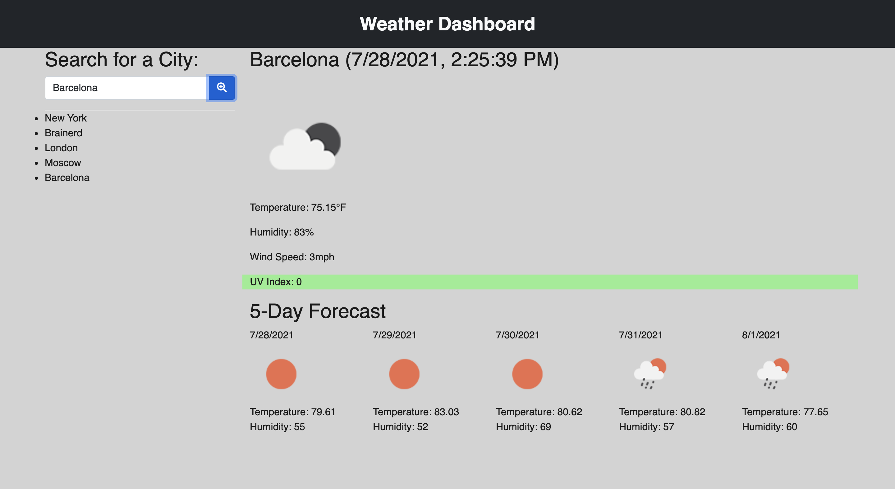

# Weather Dashboard

## Description 
This application allows users to check the weather in any city of the world while saving previously researched locations . It uses third-party APIs, runs in the browser, and features dynamically updated HTML and CSS.

We use the OpenWeather API to retrieve weather data for different cities. The data is stored in LocalStorage.

## Demo

This application can be found here:
* https://alenareh.github.io/Weather-Dashboard/

The URL of the GitHub repository that contains the code of the application:
* https://github.com/AlenaReh/Weather-Dashboard

## Contributors

- Alena Rehberger <https://github.com/AlenaReh>

​
## Credits

Thanks to w3schools <https://w3schools.com>, icons8 <https://icons8.com/icons/set/save-button>, and Trilogy Education Services for providing all of the necessery tools for building this application.

